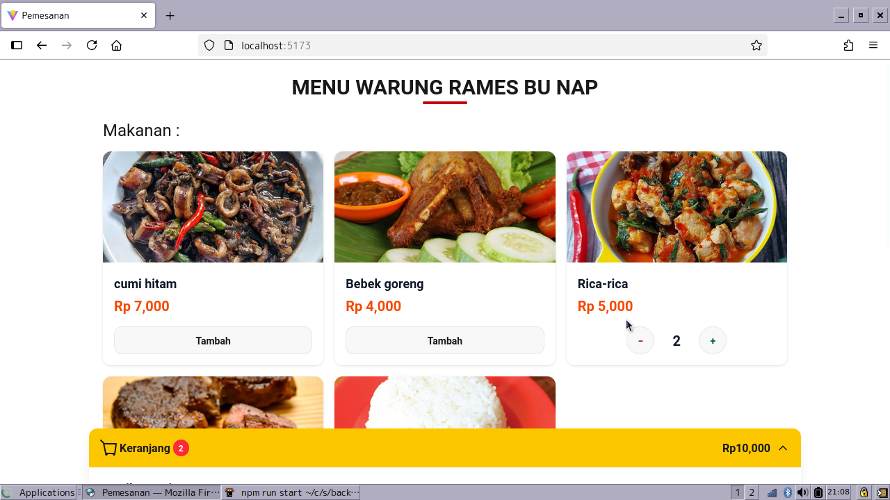
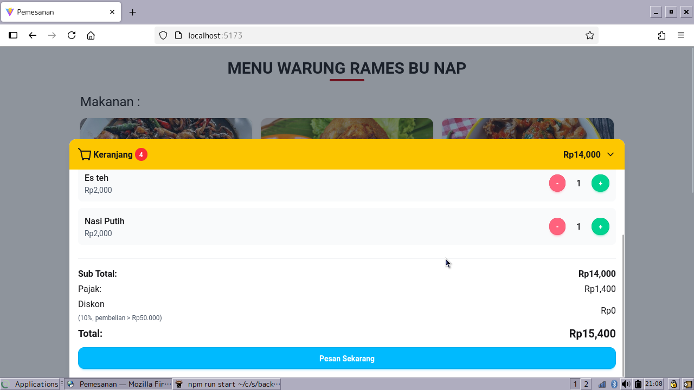
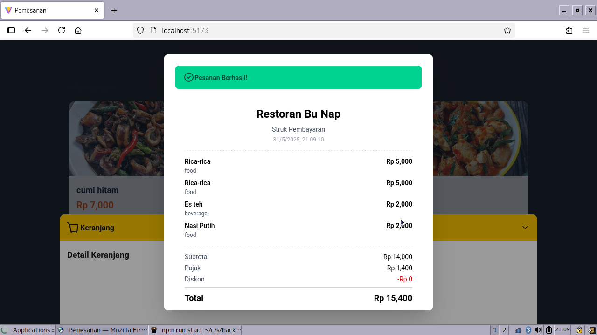
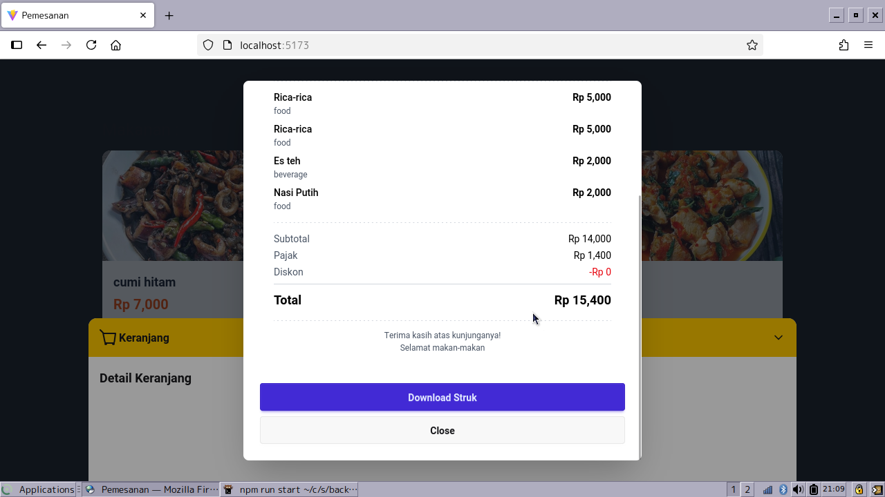
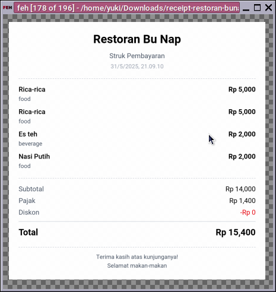

# SISTEM PEMESANAN MAKANAN
## Teknologi Yang Digunakan
- Node.js(express) Backend
- React.js Frontend

## Instalasi
### 1. Clonse repositoy
```
git clone https://github.com/Eirfand1/sistem_pemesanan_makanan.git
```
### 2. Install Dependensi express js
```
cd backend-express
npm install
```

### 3. Jalankan backend express.js
```
npm run start
```
aplikasi berjalan pada port 3000

### 4. Install Dependensi React.js
```
cd frontend-react
npm install
```

### 5. Jalankan frontend React.js
```
npm run dev
```

Buka ```http://localhost:5173``` di browser

---

## Fitur
- [x] Menampilkan Menu
- [x] Memesan menu 
- [x] Menampilkan struk setelah pesanan dikirim
- [x] Mendownload struk
- [x] Menyimpan banyak pesanan selama sesi berjalan

## REST API Dokumentasi

Base URL: `http://localhost:3000`

---

### GET `/menu`

#### Deskripsi

Mengambil seluruh daftar menu yang tersedia.

#### Response

```json
[
  {
    "id": 1,
    "name": "cumi hitam",
    "price": 7000,
    "type": "food",
    "image": "http://localhost:3000/cumi-hitam.jpg"
  },
  {
    "id": 2,
    "name": "Bebek goreng",
    "price": 4000,
    "type": "food",
    "image": "http://localhost:3000/bebek-goreng.jpg"
  },
  .....
]
```

---

### POST `/order`

#### Deskripsi

Mengirimkan pesanan berdasarkan daftar ID item makanan/minuman. Sistem akan menghitung item lengkap, subtotal, pajak, diskon (jika ada), dan total akhir.

#### Request

**Headers:**

```http
Content-Type: application/json
```

**Body:**

```json
{
  "items": [3, 3, 1]
}
```

#### Response

```json
{
  "items": [
    {
      "id": 1,
      "name": "cumi hitam",
      "price": 7000,
      "type": "food",
      "image": "http://localhost:3000/cumi-hitam.jpg"
    },
    {
      "id": 3,
      "name": "Rica-rica",
      "price": 5000,
      "type": "food",
      "image": "http://localhost:3000/rica-rica.jpg"
    },
    {
      "id": 3,
      "name": "Rica-rica",
      "price": 5000,
      "type": "food",
      "image": "http://localhost:3000/rica-rica.jpg"
    }
  ],
  "subTotal": 17000,
  "tax": 1700,
  "discount": 0,
  "total": 18700
}
```

#### Catatan

* Pajak: 10% dari subtotal
* Diskon: 10% jika subtotal > Rp50.000

---

### Static File

#### Deskripsi

Semua gambar bisa diakses langsung melalui:

```
http://localhost:3000/{nama-gambar}.jpg
```

**Contoh:**

* `http://localhost:3000/cumi-hitam.jpg`
* `http://localhost:3000/kopi-luwak.jpg`

---

## Frontend

### 1. Tampilan Menu Utama 


- Daftar makanan bergambar dengan nama dan harga.
- Tombol **Tambah** atau `+ / -` jika item sudah di keranjang.
- Keranjang selalu terlihat di bawah.

---

### 2. Tampilan Keranjang Aktif 


- Keranjang akan expand jika user klik pada panel warna kuning.
- Keranjang akan collapse kalau di klik di luar atau panel warna kuning.
- Menampilkan daftar item, jumlah, dan tombol `+`/`-` untuk menambah/mengurangi jumlah.
- Hitungan subtotal, pajak, diskon (otomatis jika beli > Rp50.000).
- Diskon 10% otomatis jika subtotal melebihi Rp50.000.
- Pajak sebesar 10% dari subtotal.
- Tombol **Pesan Sekarang** langsung melakukan checkout.

---

### 3. Popup Struk Setelah Checkout 



- Setelah pelanggan melakukan checkout, muncul popup preview struk.
- Ada opsi **Download Struk** dan **Close**.

---

### 4. Download Struk Pembayaran 


- Menampilkan nama restoran, waktu transaksi, dan daftar item yang dipesan.
- Mencantumkan kategori item (`food` / `beverage`), harga, dan subtotal.
- Terdapat perhitungan otomatis pajak dan diskon.
- Format struk adalah gambar `.png`.

---
